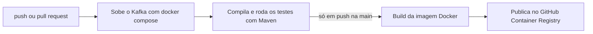

# Kafka Fácil: laboratório de estudos de Apache Kafka com Spring Boot


> **Status: em estudo ativo.** Este repositório é o meu laboratório pessoal de aprendizado de Apache Kafka com Spring Boot. Estou construindo cada exemplo do zero, entendendo o papel de cada peça e registrando o progresso por meio de commits no padrão Conventional Commits.

## Sobre o projeto

O objetivo é sair da teoria e ganhar experiência prática com Kafka em um cenário próximo do real: subir o broker com Docker, produzir e consumir mensagens com Spring for Apache Kafka, entender partições, offsets e consumer groups na prática e, nas próximas etapas, lidar com idempotência, tratamento de erros, transações (exactly-once) e observabilidade.

O estudo segue um roteiro em três níveis (fácil, médio e avançado). Em vez de apenas copiar os exemplos, estou montando cada projeto à mão, reorganizando o código em pacotes, corrigindo problemas que aparecem pelo caminho e fazendo os experimentos propostos para observar o comportamento do Kafka.

## Stack

Java 21, Spring Boot 3.3, Spring for Apache Kafka, Apache Kafka 3.8 em modo KRaft (sem Zookeeper), Kafka UI, Docker e Docker Compose, Maven e GitHub Actions.

## Progresso

- [x] **Ambiente:** Kafka em modo KRaft e Kafka UI com Docker Compose; uso da CLI do Kafka (`kafka-topics`, `kafka-console-producer`, `kafka-console-consumer`, `kafka-consumer-groups`)
- [x] **F1, Hello Kafka:** producer via endpoint REST com `KafkaTemplate`, consumer com `@KafkaListener`, criação de tópico com `NewTopic`
- [ ] **F1, experimentos:** reprocessamento com novo consumer group, leitura de lag e distribuição entre partições
- [ ] **CI/CD:** pipeline no GitHub Actions com build, testes e publicação da imagem Docker
- [ ] **M1:** mensagens em JSON, chaves de partição, ordenação por chave e múltiplos consumer groups
- [ ] **M2:** producer idempotente, commit manual de offset e consumidor idempotente
- [ ] **M3:** retry não bloqueante com `@RetryableTopic` e Dead Letter Topic
- [ ] **A1:** pipeline de pagamentos exactly-once com PostgreSQL, Prometheus, Grafana e Zipkin

## Estrutura do repositório

```
kafka_facil/
├── .github/workflows/ci.yml     # pipeline de CI/CD (GitHub Actions)
├── docker-compose.yml           # Kafka + Kafka UI (+ aplicação, com o profile "app")
├── README.md
└── hello-kafka/                 # exemplo F1
    ├── Dockerfile               # build multi-stage da aplicação
    ├── pom.xml
    └── src/main/java/com/amztec/hello_kafka/
        ├── HelloKafkaApplication.java
        ├── config/TopicoConfig.java           # declara o tópico hello-topic (3 partições)
        ├── controller/MensagemController.java # producer: POST /mensagens
        └── listener/MensagemListener.java     # consumer: loga valor, partição e offset
```

## Como executar

### Pré-requisitos

Docker Desktop (com Docker Compose) e JDK 21. O Maven não é obrigatório, porque o projeto inclui o Maven Wrapper (`mvnw`).

### 1. Subir o Kafka

Na raiz do repositório:

```bash
docker compose up -d
docker compose ps   # aguarde o kafka ficar "healthy"
```

O Kafka UI fica disponível em http://localhost:8090.

### 2. Rodar a aplicação

Pela IDE (Spring Tools, IntelliJ etc.), executando a classe `HelloKafkaApplication`, ou pelo terminal:

```bash
cd hello-kafka
./mvnw spring-boot:run
```

### 3. Enviar mensagens

```bash
curl -X POST "http://localhost:8080/mensagens?texto=Ola"

for i in 1 2 3 4 5 6; do curl -s -X POST "http://localhost:8080/mensagens?texto=msg-$i"; echo; done
```

No Postman: método `POST`, URL `http://localhost:8080/mensagens` e, na aba **Params**, a chave `texto` com a mensagem desejada.

No log da aplicação aparecem linhas como:

```
Recebido: 'msg-3' | partição=1 | offset=0
```

### Rodando tudo em containers

A aplicação também pode rodar em container, junto com o Kafka, sem precisar de Java instalado na máquina:

```bash
docker compose --profile app up -d --build
```

Dentro da rede do Docker, a aplicação se conecta ao Kafka por `kafka:29092` (listener interno), enquanto aplicações rodando direto na máquina usam `localhost:9092` (listener externo). Pare a aplicação da IDE antes, porque as duas usam a porta 8080.

### Limpar o ambiente

```bash
docker compose down -v   # remove containers e dados do Kafka
```

## Conceitos praticados até aqui

**Tópico, partição e offset.** Um tópico é dividido em partições, e cada partição é um log ordenado que só cresce no final. O offset é uma posição dentro do log de uma partição: a mensagem usa o offset para dizer onde está gravada, e o consumer group guarda um offset para dizer de onde vai continuar lendo. Cada partição tem sua própria numeração, começando em 0.

**Consumir não apaga.** As mensagens ficam no tópico até o prazo de retenção expirar. Grupos diferentes leem o mesmo tópico de forma independente, cada um com seu próprio offset salvo no tópico interno `__consumer_offsets`.

**Listeners do broker.** O Kafka anuncia endereços diferentes conforme quem se conecta: `localhost:9092` para aplicações na máquina e `kafka:29092` para outros containers, como o Kafka UI.

**`KafkaTemplate`.** É o producer na versão Spring: um wrapper thread-safe sobre o `KafkaProducer`, configurado automaticamente pelo Spring Boot a partir de `spring.kafka.producer.*`. O `send()` é assíncrono.

**`@KafkaListener`.** O Spring cria um listener container, com um `KafkaConsumer` rodando em uma thread própria, que faz o `poll()`, desserializa as mensagens, chama o método anotado e faz o commit do offset.

**Spring em geral.** Injeção de dependência por construtor, `@Configuration` e `@Bean` para registrar objetos de bibliotecas de terceiros (como o `NewTopic`), `@Component` e a diferença entre `@RequestParam`, `@PathVariable` e `@RequestBody`.

## Pipeline de CI/CD

O repositório usa GitHub Actions (arquivo `.github/workflows/ci.yml`). O pipeline tem dois jobs:



1. **Build e testes (CI):** roda em todo push e pull request. Sobe o próprio Kafka do `docker-compose.yml` no servidor do GitHub, compila o projeto e executa os testes. Se algo quebrar, o commit fica marcado com um ❌.
2. **Publicação da imagem (Continuous Delivery):** roda apenas em push na branch `main`, e só se o job anterior passar. Gera a imagem Docker da aplicação e publica em `ghcr.io`, deixando uma versão pronta para ser implantada.

Ainda não há deploy automático em um servidor (Continuous Deployment). Esse é um passo futuro do estudo.

## Próximos passos

Concluir os experimentos do F1, avançar para os exemplos do nível médio (JSON, idempotência, commit manual de offset, retry e DLT), adicionar testes de integração com Testcontainers e, no nível avançado, implementar transações Kafka e observabilidade com métricas, traces e logs correlacionados.

## Convenção de commits

Os commits seguem o padrão [Conventional Commits](https://www.conventionalcommits.org/pt-br/), por exemplo `feat(hello-kafka): ...`, `chore(docker): ...`, `ci: ...` e `docs: ...`.

## Referências

- [Documentação do Apache Kafka](https://kafka.apache.org/documentation/)
- [Spring for Apache Kafka](https://docs.spring.io/spring-kafka/reference/)
- [Documentação do GitHub Actions](https://docs.github.com/actions)

## Autor

**André Muniz**, desenvolvedor Java estudando mensageria e sistemas distribuídos.
[LinkedIn](https://www.linkedin.com/in/SEU-PERFIL) · [GitHub](https://github.com/SEU-USUARIO)
